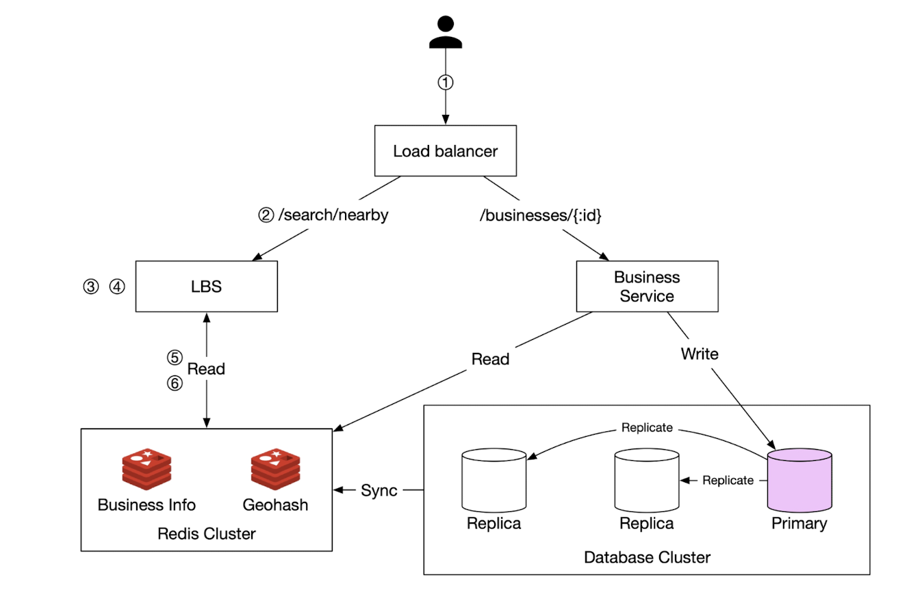
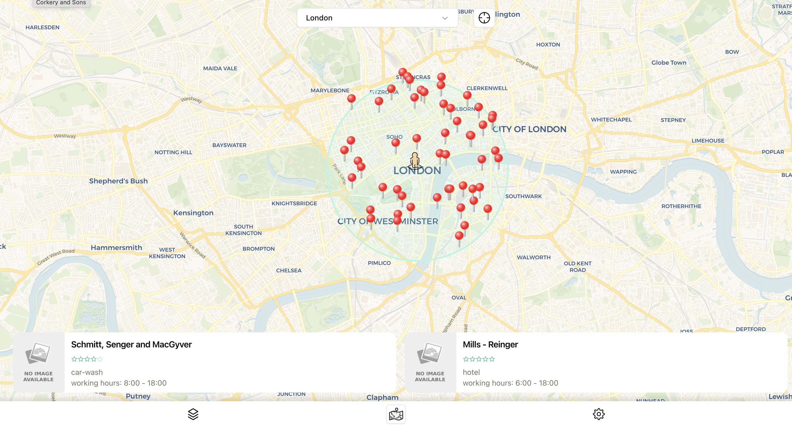
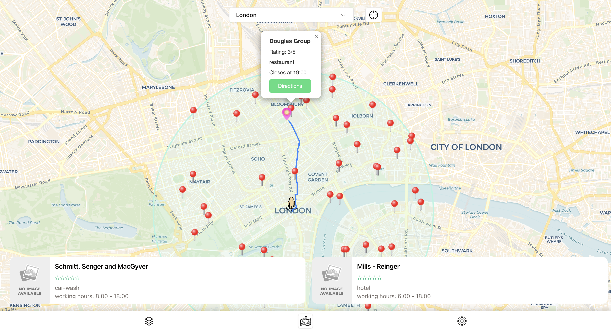

# Proximity service

Implementation of proximity service that shows nearby businesses at user's request. Similar to real world services like Google Maps, but much less features, with core feature of showing close to a user businesses within queried range.

Unfortunately, there is no quick access to check the project, since it's not hosted anywhere.

## Description

Service works as follows:

1. Client requests businesses withing specified radius (configurable on front end app). 
2. The client sends request to reverse proxy. 
3. The proxy forwards the request to the LBS. 
4. Based on the user location and radius info, the LBS finds the ids of the businesses that matches the search . 
5. LBS gets hydrated business data from redis cache and returns to the client

You can also add businesses via api.



*Current implementation does not use replica clusters.

Service also features pathing to a business or to a random point. Data is pulled from [Overpass API](https://wiki.openstreetmap.org/wiki/) and shortest path is calculated on the server using [A star search algorithm](https://en.wikipedia.org/wiki/A*_search_algorithm)




## Technologies used

- Redis / Redis GEO
- MongoDB
- Rust with Tokio and Serde crates, with no backend framework
- Svelte for client
- Nginx for reverse proxy
- Docker / Docker compose
- JavaScript for fake data generator

## Booting up

You would need `Docker` and `Node` installed on your system to check the project.

Start by cloning the repo
```
git clone https://github.com/JuniFruit/proximity-service.git
```

Create `.env` file in root of the repo and clone contents of existing `.example.env`

```
touch ./.env

cat .example.env >> .env
```
Use script to start all services

```
./start-all.sh
```

## Generating fake data

At this point you have all your services running, but you DBs don't have any data to work with. You can generate data with simple JS script. It contains csv table with all major cities. We use lon and lat of a city to generate business at random within a certain radius. Keep in mind it's just for demonstration and there is no check if a random lon and lat is actually located on a piece of land. You can adjust values within the script if you want less or more density
```
const maxBusinessPerCity = 70;
```

To generate the data do the following
```
cd ./scripts

npm install

npm run gen
```
Wait for completion and now you can visit your front end app to work with the service. By default it's [http://localhost:3000](http://localhost:3000)